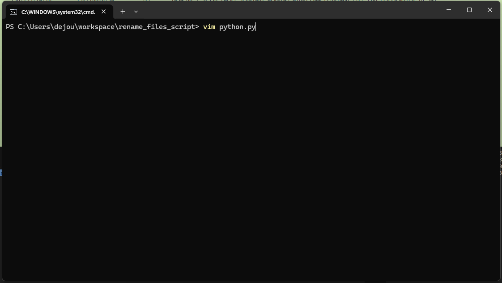
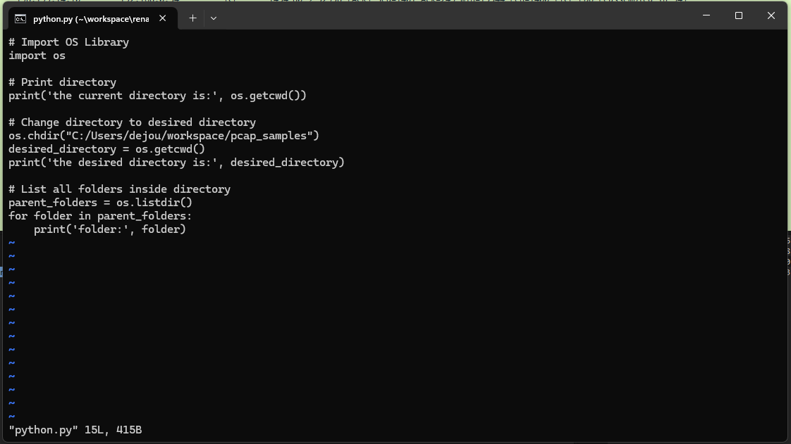
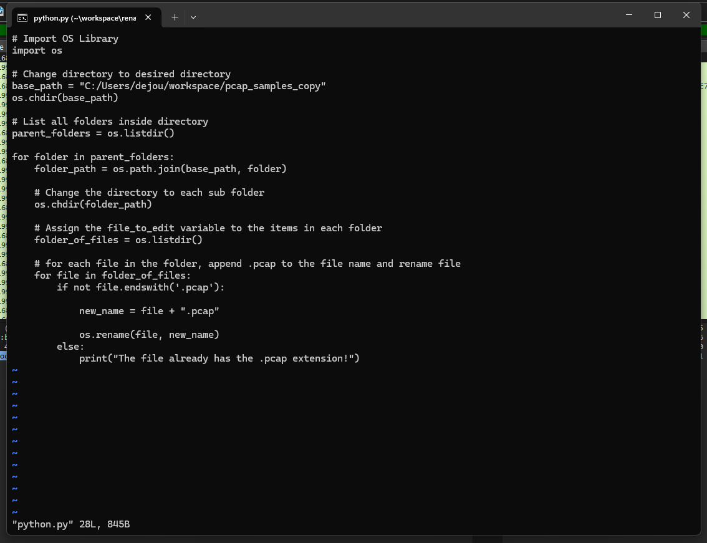
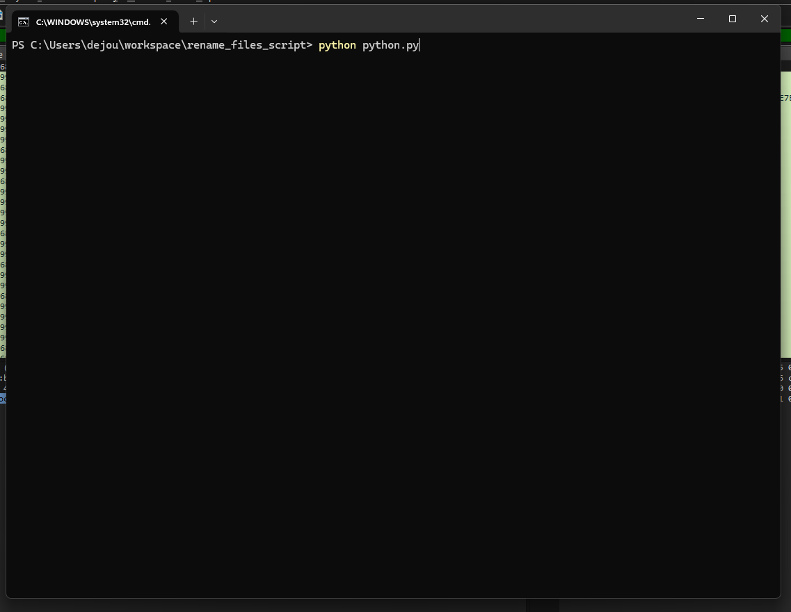
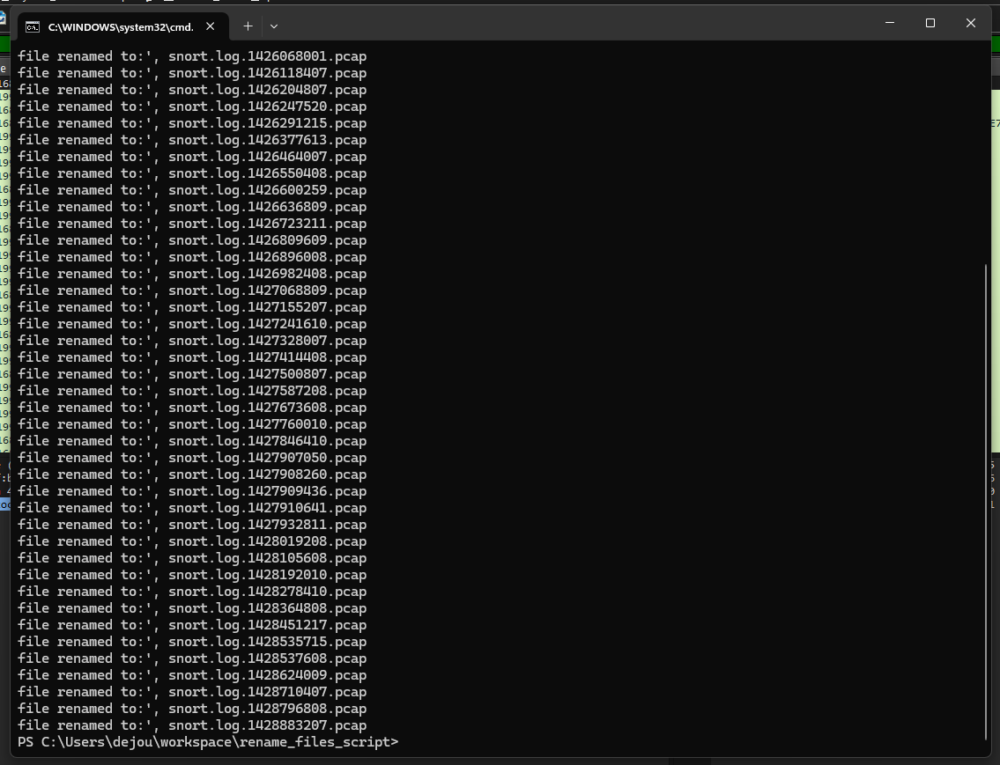

# Python Script To Convert Files In Folder By Renaming Them

## Objective
Append .pcap to the end of each file name to convert the downloaded files from .snort files to .pcap files to be opened in Wireshark. The Parent Folder has a large amount of Child Folders, so it would be tedious to do manually.

## Tools Needed
-Python

## Scenario
The parent folder has a large amount of child folders each containing a .snort file. Write a Python script that loops through each folder and appends .pcag to the end of the name to convert it from a .snort file to a .pcap file that Wireshark can read/open.

## Files Included
| File | Description |
|------|-------------|
| `rename_file_script.py` | Python Script File To Rename Files |

## What I Learned
-How to use OS module functions

    os.getcwd() --> Gets current directory

    os.chdir() --> Changes directory
   
    os.listdir() --> Lists all items in directory
   
    os.rename() --> Renames file

-How to traverse directories and subdirectories programmatically

-The importance of using os.path.join() for building platform-independent file paths

-How to safely rename files using conditional logic to avoid redundant naming

## What I Did 
1. Created python file

2. Imported OS

3. Changed to parent directory

4. Looped through folders

5. Change directory into each sub folder

6. List files in each sub folder

7. Loop through each file in case of more than one

8. Create safeguard for appending .pcap to file name if it already exists

9. Append .pcap to file name and rename file

## Skills Demonstrated
-Python Scripting

-Automating manual workflows

-File system traversal with os

-Problem-solving under pressure

## Screenshots
Created File

Code With Print Statments For Debugging

Production-Ready Code with Print Statements Removed

Executing the Python Script

Confirmation That The Script Successfully Renamed Each File

